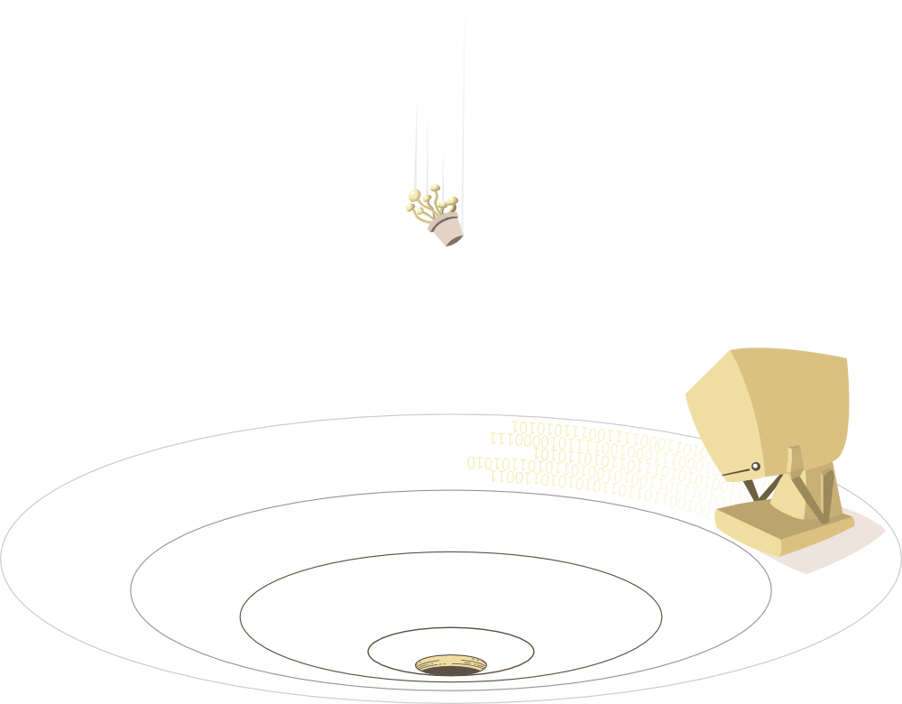

> A curated list of Quantum Computing resources, articles, programming languages and projects. The main idea is that everyone can contribute here, so we can have a central repository of informations about this mind-boggling subject that we all can keep up-to-date.

Inspired by the [awesome](https://github.com/sindresorhus/awesome) list thing.

## What is Quantum Computing

Human evelution depends on developing an alternative model of computation to classic computers.

1- Machine Learning
2- Genetic Engineering
3- Artificial Intelligence

Physical resources used to build Quantium Computers,  

- Entanglement
- Quantium Tunneling
- Superposition

## D-Wave

- [D-Wave Systems](http://www.dwavesys.com): a leading quantum computing company, built first quantum computer, ever!
- [Google's D-Wave](http://www.techtimes.com/articles/114614/20151209/googles-d-wave-2x-quantum-computer-100-million-times-faster-than-regular-computer-chip.htmGoogle's D-Wave): D-Wave's 2X Quantum Computer 100 Million Times Faster Than Regular Computer Chip
- [Quantum Journey](http://www.techtimes.com/articles/114614/20151209/googles-d-wave-2x-quantum-computer-100-million-times-faster-than-regular-computer-chip.htmGoogle's D-Wave): D-Wave Chief Scientist, Eric Ladizinsky talking about the beginnings of building the first Quantium Computer based on Macroscopic Quantium Objects.

## Articles

- [A programming language for living cells](http://news.mit.edu/2016/programming-language-living-cells-bacteria-0331): New language lets researchers design novel biological circuits.
- [Artificial Molecules](http://www.sciencealert.com/scientists-have-discovered-a-way-to-make-their-own-molecules): Scientists have figured out how to make their own molecules from scratch.
- [DNA Data Storage](http://blogs.discovermagazine.com/d-brief/2016/04/08/dna-data-storage/#.Vw1rmnUrLVO): DNA Data Storage Moves Beyond Moore’s Law.
- [Scientific Swap Meet Behind the gene-editing Boom](https://www.technologyreview.com/s/601156/the-scientific-swap-meet-behind-the-gene-editing-boom): The gene-editing technology called CRISPR is probably the fastest-spreading technology in the history of biology.

## Complexity Theory

## Books

- [Quantum Bits and Quantum Secrets](http://ca.wiley.com/WileyCDA/WileyTitle/productCd-3527407103.html): How Quantum Physics is revolutionizing Codes and Computers.
- [Quantum Computing](http://ca.wiley.com/WileyCDA/WileyTitle/productCd-3527407871.html): Revised and Enlarged, 2nd Edition.

## Programming Languages
- [LIQUi](http://stationq.github.io/Liquid/): The Language Integrated Quantum Operations Simulator.

## Resources
- [QuArC](http://research.microsoft.com/en-us/groups/quarc/default.aspx): Quantum Architectures and Computation.

## Contributing

Your contributions are always welcome! [Click Here to read the guidelines](https://github.com/websemantics/awesome-synthetic-biology/blob/master/contributing.md).

## License

This work is licensed under a [Creative Commons Attribution 4.0 International License](http://creativecommons.org/licenses/by/4.0/).
